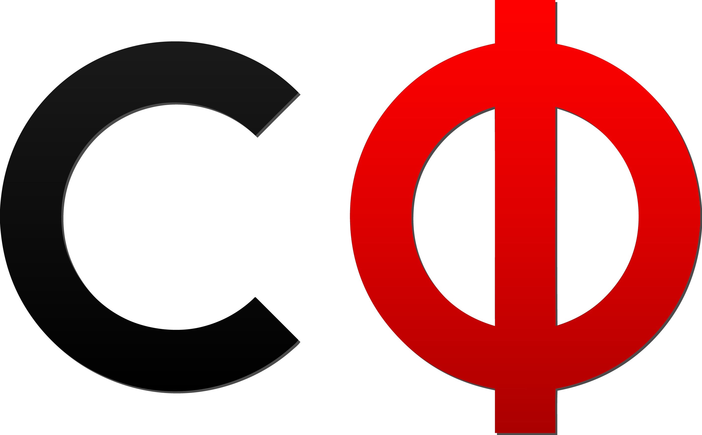
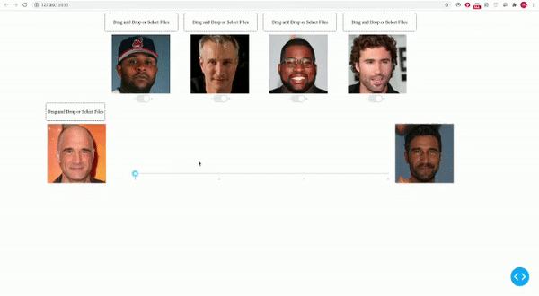
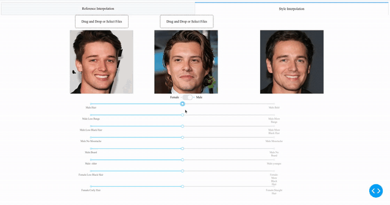
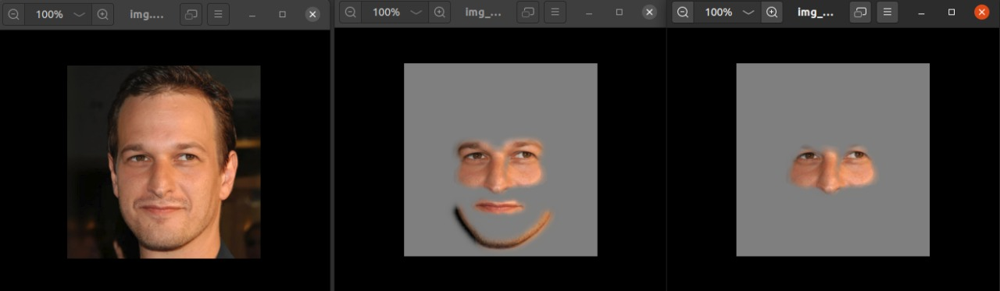
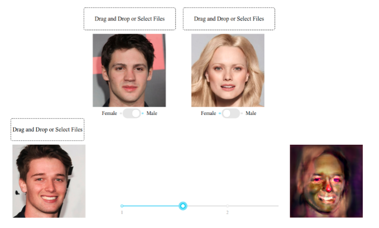
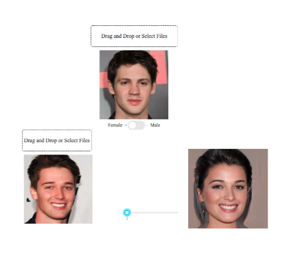
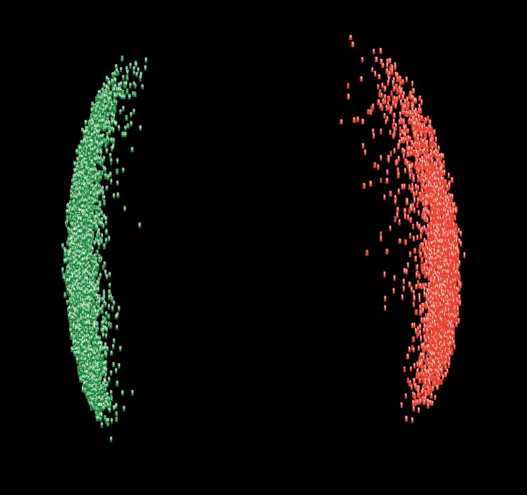

# Style Transfer - Analytics Club, IIT Madras 

    
     
    Teaser Video: Top row denotes source images, and the leftmost column denotes the reference images from which the style is being transferred.

## Repository Contents

- [annotated paper](./assets/starganv2.pdf)
- [paper implementation codes](./baseline/)
- [face alignment model](./app/facealignment.py) from [paper](https://arxiv.org/abs/1904.07399) 
- [resnet model for attribute classification](./classifier/classifier.py)
- [helper functions for latent interpolation](./app/interpolate.py)
- [style codes with predicted attributes for all images](./app/attributes/)
- [trained svm boudaries for selected attributed](./app/svms)
- [app using dash and flask](./app/app.py)

## Links

- celeb_a dataset (male, female) - [full](https://drive.google.com/file/d/1wZUSNbxFdpkY1kPua4xGIdcroEUHGabt/view), [sample](https://drive.google.com/file/d/1KcgEXQRGzOZnCSxU-lzG62vXlK54da-p/view?usp=sharing)
- celeb_a attribute dataset - [link](https://drive.google.com/file/d/1X6QHlyJRLDdxpKcvlshCSxHrL71kkG0W/view?usp=sharing)
- pretrained models - [starganv2](https://drive.google.com/file/d/1gSZjhmZGeV54EuhLlQ-8Poas4g07VoTC/view?usp=sharing), [classifier](https://drive.google.com/file/d/1dX5HsynnSnPSkjdO4XWYICz0VbnGdQoE/view?usp=sharing)
- [Session 1 recording](https://drive.google.com/file/d/1xkc7k_7ZpTrddwO7wHV4yNvozlVaeElL/view?usp=drivesdk) - Intro to GANs, Understanding the paper.
- Session 2 recording [part 1](https://drive.google.com/file/d/1ZEbiNfsydYahQtnQ4IxTxzEZaSNJSLQR/view?usp=drivesdk) - Dataloaders and basic model blocks, [part 2](https://drive.google.com/file/d/16dg3du6yQmyvH-r2yI11LvhpkvV5fl99/view?usp=drivesdk) - complete model, training and validation helper functions.
- [Session 3 recording](https://drive.google.com/file/d/15UVlPspfu3Dv4nF5ntq5CRFFs7AjF92e/view?usp=sharing) - training large models on VMs, possible improvements, deploying app using dash and flask, interesting intuitions and manipulating latent space.

    <b>Interpolation with reference images</b>
     
    

    <b>Interpolation of latent space to manipulate certain attributes</b>
     
    

    <b>Masks generated using masking model to retain features like eyes, nose and mouth of the source image</b>
     
    

## Interesting observations

    <b>Demon-like images during cross domain interpolation</b>
     
    

    <b>Retention of domain characteristics irrespective of reference image</b>
     
    

    <b>Well seperated domain latent spaces</b>
     
    

    <b>Grad Cam to visualise activations to understand each feature of the latent space</b>
     
    

